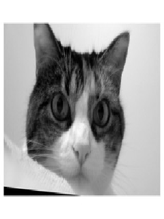
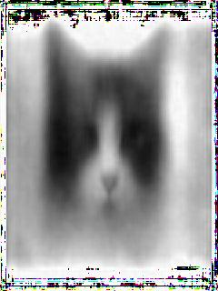

# cat_compressor
This projects goal is to compress images using a neural network. By the "fallen over 
hourglass" shape of the neural network (aka a autoencoder), we hope to be able to
produce new images by feeding some (random?) data into the middle of the neural network.
Btw everything will be done using images of cat faces.

### example output
so far the cats are looking as follows:

it should be quite obvious which one is the original cat and which one was output by the
nn after compression to 30 parameters. Note that the cat is from the validation dataset.

### getting this project to run on your machine
... is quite difficult.

Anyhow, you will want to get all the data and the pretrained model from 
[here](https://drive.google.com/drive/folders/1K58Dt07-jXyqFFZDlCrxCmVxdoDTbXZe?usp=sharing). 
Move the cat images to your ~/.keras/datasets directory. There is a 
somewhat pretrained nn weight and biases that you should move into the 
cat_compressor directory.

Get the following python modules:

* tensorflow and keras
* pillow
* pickle
* scipy
* sklearn

Run python cat_creator.py.

Open index.html with a web browser.

### current issues
* greyscale instead of color is used as the nn is having a hard time understanding rgb
(maybe changing the first few layers of the nn could help)
* one colored areas (e.g. (1, 0, 0), (1, 1, 1) in rgb) appear weired
* larger images take to long to train
